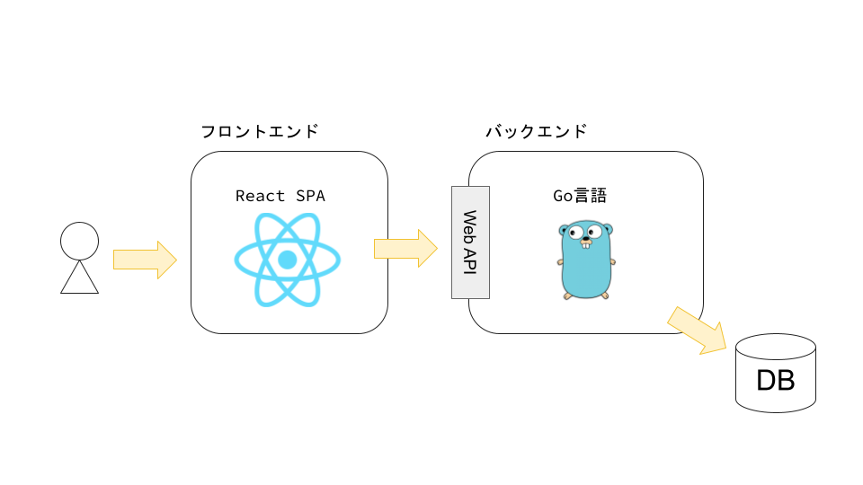

# gorails

gorailsはRuby on Railsを参考にした、Go言語とReactでWebアプリケーションを作成するためのコマンドラインツールです。
ソースコードのディレクトリ構成など、Ruby on Railsと似たような感覚でMVCモデルのWebアプリケーションを作成できます。

## 作成するアプリケーションアーキテクチャ

gorailsで作成するアプリケーションは基本的にRuby on Railsと同じなのですが、フロントエンドとしてReactを使うため以下のような構成になります。
※Go言語のtemplate packageを使うことでRailsのほぼ同じ構成をとることもできるのですが、2023年の現実問題としてフロントエンドの開発はReact一強なため、最初からこの構成にしています。



## インストール手順

まずはGo言語とNode.js(npm)をインストールします

- Go言語インストール手順: https://go.dev/doc/install
- Node.jsインストール手順: https://nodejs.org/ja/

次にgorailsコマンドをインストールします

```bash
go install github.com/sh-miyoshi/gorails@latest
gorails --help
```

## クイックスタート

[examples/1_quickstart](./examples/1_quickstart.md)にサンプルWebアプリケーションの作り方をまとめたので参考にしてください。

## アプリで使える環境変数

gorailsコマンドで作成したWebアプリケーションでは、デフォルトで以下の環境変数によって動作を制御できます

|環境変数名|デフォルト値|説明|
|:----|:----|:----|
|ENV|development|環境を指定します|
|ENABLE_SPA|false|trueの場合、clientコードをビルドした静的ファイルをサーバ側で配信します。これにより一つのサーバで起動できるようになります|
|SERVER_ADDR|0.0.0.0:3100|サーバーのアドレスです|

## Notes

gorailsではModelの実装として[GORM](https://gorm.io/ja_JP/docs/index.html)を使用しています。
そのため、gorailsコマンドでModelを生成後はGORMのフォーマットに則って実装してください。
