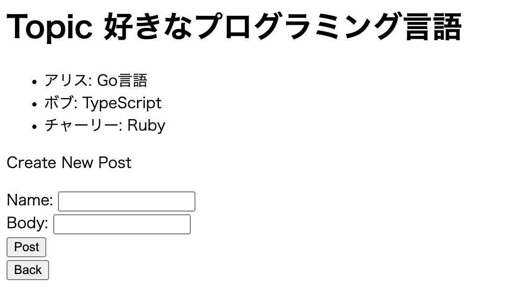
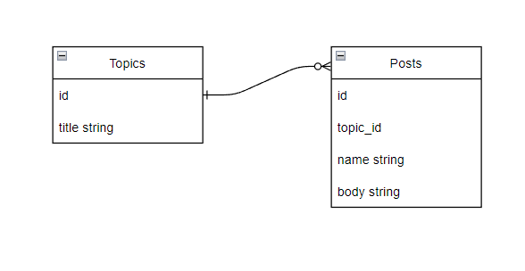

# modelにリレーションをつける

※このドキュメントは[1_quick_start](./1_quick_start.md)のアプリが前提となっています。
まだやってない方は先にそちらを実施してください。

## 概要

このドキュメントではModelにリレーションをつける方法の解説をします。
具体的にはquick startの掲示板アプリのTopicにメッセージを保存できるようにしたいと思います。

### 出来上がりのイメージ



## 1. Modelにリレーションをつける

メッセージを保存するためのPost modelを作成し、Topicと関連付けてやります
関連性としては下の図のようにhas manyの関係です



まずはPostモデルをコマンドで作成します

```bash
gorails generate model post --columns name:string --columns body:string --columns topic_id:string 
```

次にmodelファイルを修正して、TopicとPostを関連付けます

```bash
vi app/models/topic.go
# type Topic struct {
#  ID        string `gorm:"uniqueIndex"`
#  CreatedAt time.Time
#  UpdatedAt time.Time

#  Title string
#  Posts []Post
# }

vi app/models/post.go
# type Post struct {
#  ID        string `gorm:"uniqueIndex"`
#  CreatedAt time.Time
#  UpdatedAt time.Time

#  Name    string
#  Body    string
#  TopicID string
# }
```

Postモデルの`Topic_id`を`TopicID`にしてあげることでGORMにより外部キーが自動作成されます

## 2. API Schema, Controllerの作成

controller.TopicShowメソッドから返されるレスポンスにPostの情報を含めるようにします
そのためまずはAPI Schemaを拡張します

```bash
vi config/api_schema.yaml
# - type: Post
#   columns:
#     - key: name
#       format: string
#     - key: body
#       format: string
# - type: Topic
#   columns:
#     - key: id
#       format: string
#     - key: title
#       format: string
#     - key: posts
#       format: "[]Post"
gorails generate api
```

そしてcontroller.TopicShowメソッドを修正してPostデータも返すようにします
ポイントはtopic取得時にPostsをpreloadしている箇所です

```bash
vi app/controllers/topic_controller.go
```

```go
// ・・・略・・・
func TopicShow(w http.ResponseWriter, r *http.Request) {
 vars := mux.Vars(r)
 id := vars["topic_id"]

 var topic models.Topic
 system.DB().Preload("Posts").Where(&models.Topic{ID: id}).First(&topic)

 posts := []schema.Post{}
 for _, p := range topic.Posts {
  posts = append(posts, schema.Post{
   Name: p.Name,
   Body: p.Body,
  })
 }

 result := schema.Topic{
  Id:    topic.ID,
  Title: topic.Title,
  Posts: posts,
 }

 w.Header().Add("Content-Type", "application/json")
 json.NewEncoder(w).Encode(&result)
}
// ・・・略・・・
```

## 4. Postを登録するためのAPIを作成

画面からPostを投稿された際に受け取ってDBに登録するためのAPIを追加します

```bash
gorails generate controller post --methods create
vi config/routes.go
# r.HandleFunc("/api/topics/{topic_id}/posts", controllers.PostCreate).Methods("POST")
```

```bash
vi app/controllers/post_controller.go
```

```go
package controllers

import (
 "encoding/json"
 "net/http"

 "github.com/gorilla/mux"
 "github.com/sh-miyoshi/sample-project/app/models"
 "github.com/sh-miyoshi/sample-project/app/schema"
 "github.com/sh-miyoshi/sample-project/system"
)

func PostCreate(w http.ResponseWriter, r *http.Request) {
 vars := mux.Vars(r)
 topicID := vars["topic_id"]

 var req schema.Post
 if err := json.NewDecoder(r.Body).Decode(&req); err != nil {
  http.Error(w, "Bad Request", http.StatusBadRequest)
  return
 }

 post := models.Post{
  Name:    req.Name,
  Body:    req.Body,
  TopicID: topicID,
 }

 system.DB().Create(&post)
 w.WriteHeader(http.StatusCreated)
}
```

## 5. 画面の修正

TopicShow画面にメッセージ一覧を表示し、新規でメッセージを送信できるようにフォームを作ります

```bash
vi client/src/pages/topics/show/show.tsx
```

```tsx
import React, { useState, useEffect } from 'react';
import { useNavigate, useParams } from 'react-router-dom';
import { httpRequest } from '../../../helpers/http_request';
import { Topic, Post } from '../../../types/application';

const TopicsShow = (props) => {
  const [topic, setTopic] = useState<Topic>({})
  const [newPost, setNewPost] = useState<Post>({})
  const { topic_id } = useParams()
  const navigate = useNavigate()

  const back = () => {
    navigate(-1)
  }

  useEffect(() => {
    httpRequest<Topic>('get', `http://localhost:3100/api/topics/${topic_id}`)
      .then((res) => {
        setTopic(res.data)
      })
      .catch((err) => {
        window.console.error(err)
      })
  }, [setTopic, topic_id])

  const handleNameChange = (e) => {
    setNewPost({
      name: e.target.value,
      body: newPost.body
    })
  }

  const handleBodyChange = (e) => {
    setNewPost({
      name: newPost.name,
      body: e.target.value,
    })
  }

  const onPost = async () => {
    if (newPost.name == '' || newPost.body == '') {
      return
    }

    await httpRequest('post', `http://localhost:3100/api/topics/${topic_id}/posts`, {
      name: newPost.name,
      body: newPost.body
    })
    window.location.reload()
  }

  return (
    <div>
      <h1>Topic {topic.title} </h1>
      {topic.posts != null &&
        <div>
          {topic.posts.length == 0 ? <div>No posts</div> :
            <ul>
              {topic.posts.map((p, i) => (
                <li key={i}>{p.name}: {p.body}</li>
              ))}
            </ul>
          }
        </div>
      }
      <div>
        <p>Create New Post</p>
        Name: <input type="text" value={newPost.name} onChange={handleNameChange} /><br />
        Body: <input type="text" value={newPost.body} onChange={handleBodyChange} /><br />
        <button onClick={onPost}>Post</button>
      </div>
      <button onClick={back}>Back</button>
    </div>
  )
}

export default TopicsShow
```
