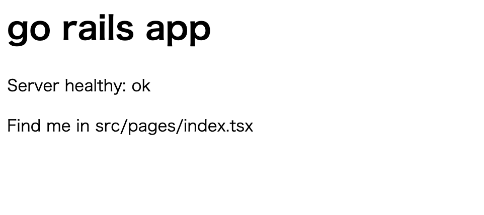

# Webアプリ制作

このページではgorailsコマンドを使って実際にWebアプリケーションを作成する方法を解説します。

## 今回作成するWebアプリケーションの全体像

WIP

## 1. プロジェクトの作成

最初にプロジェクトを作成します。
なお、gorailsコマンドのダウンロードが終わってない場合は先に[READMEのインストール手順](https://github.com/sh-miyoshi/gorails#%E3%82%A4%E3%83%B3%E3%82%B9%E3%83%88%E3%83%BC%E3%83%AB%E6%89%8B%E9%A0%86)を参照してダウンロードしてください。

`gorails new [プロジェクト名] --project-path="[プロジェクトパス]"`コマンドでプロジェクトを作成できます。
プロジェクトパスは`go mod init`時の引数として利用します。
またコンテナイメージの作成する際のイメージ名にも利用します。

```bash
gorails new sample-project --project-path="github.com/sh-miyoshi/sample-project"
cd sample-project
```

## 2. 開発用サーバの起動

docker composeでは開発時に使うPostgreSQLとその表示ツールであるadminerを立ち上げます。
adminerの方は必須ではないので不要な方はdocker-compose.ymlから削除してください。

gorailsではサーバー側をgo言語で、クライアント側をReactでアプリケーションを開発します。
最終的には一つのdockerイメージとして提供できますが、開発時は分けてそれぞれで管理する方が都合が良かったので、若干手間ですがgorails serverとclkientコマンドでそれぞれターミナルを使うようにしています。

```bash
docker compose up -d
gorails server
# 別のターミナルを開く
gorails client
```

client/server側の両方がうまく起動している場合、以下のように表示されます。



## 3. サーバー側の実装

まずはTopic modelから作成します。
model名を入れて、`--columns`オプションでカラムを設定できます。
columnsのフォーマットは`<カラム名>:<型>`です。
型情報は内部で使っているGORMが対応している型でお願いします。

```bash
gorails generate model topic --columns title:string
```

次にcontrollerとアクセスパスを設定します。
controllerの作成では引数としてメソッドを指定できます。
アクセスパスは`config/routes.go`ファイルに直接記述します。
今回は`/api`をつけていますが、`/api/v1`のようにバージョニングしてもいいですし、つけなくても動作はします。
ただし、プレフィックスをつけない場合でかつ後述のようにclientのコードを同一サーバで起動する場合は、パスがコンフリクトしないように注意してください。

```bash
gorails generate controller topic --methods index --methods show --methods create
vi config/routes.go
# r.HandleFunc("/api/topics", controllers.TopicIndex).Methods("GET")
# r.HandleFunc("/api/topics", controllers.TopicCreate).Methods("POST")
# r.HandleFunc("/api/topics/{topic_id}", controllers.TopicShow).Methods("GET")
```

サーバ特亜ラインとのやり取りはWeb APIで行うように設計しています。
そのためそのAPIスキーマを作成します。

```bash
vi config/api_schema.yaml
# - type: Topic
#   columns:
#     - key: id
#       format: string
#     - key: title
#       format: string
gorails generate api
```

続いてcontrollerの中身を作成していきます。
`system.DB()`メソッドでDatabaseとのコネクションを取得できます。
それに対してGORMのフォーマットでデータを取得します。
取得したデータに対してjson形式でAPIのレスポンスを組み立てます。

```bash
vi app/controllers/topic_controller.go
```

```go
package controllers

import (
 "encoding/json"
 "net/http"

 "github.com/gorilla/mux"
 "github.com/sh-miyoshi/dist/app/models"
 "github.com/sh-miyoshi/dist/app/schema"
 "github.com/sh-miyoshi/dist/system"
)

func TopicIndex(w http.ResponseWriter, r *http.Request) {
 var topics []models.Topic
 system.DB().Find(&topics)

 result := []schema.Topic{}
 for _, t := range topics {
  result = append(result, schema.Topic{
   Id:    t.ID,
   Title: t.Title,
  })
 }

 w.Header().Add("Content-Type", "application/json")
 json.NewEncoder(w).Encode(&result)
}

func TopicShow(w http.ResponseWriter, r *http.Request) {
 vars := mux.Vars(r)
 id := vars["topic_id"]

 var topic models.Topic
 system.DB().Find(&topic, models.Topic{ID: id})

 result := schema.Topic{
  Id:    topic.ID,
  Title: topic.Title,
 }

 w.Header().Add("Content-Type", "application/json")
 json.NewEncoder(w).Encode(&result)
}

func TopicCreate(w http.ResponseWriter, r *http.Request) {
 var req schema.Topic
 if err := json.NewDecoder(r.Body).Decode(&req); err != nil {
  http.Error(w, "Bad Request", http.StatusBadRequest)
  return
 }

 topic := models.Topic{
  Title: req.Title,
 }

 system.DB().Create(&topic)
 w.WriteHeader(http.StatusCreated)
}
```

## 4. クライアント側の実装

続いてクライアント側を実装していきます。
クライアント側のコードは全て`client/`配下に保存されます。
Topic一覧を表示するIndexメソッドとTopicの詳細を表示するShowメソッドを作成し、アクセスするためのパスを作成します。
ルーティングにはreact-routerを使用しています。

```bash
gorails generate view topics --method index
gorails generate view topics --method show

vi client/src/index.tsx
# <Route path="/topics" element={<TopicsIndex />} />
# <Route path="/topics/:topic_id" element={<TopicsShow />} />
```

各ページの中身も作っていきます。
まずはindex側からです。
Indexページではページロード時にTopic一覧をapi経由でサーバーから取得しtopics変数に格納します。
またCreateボタン押下時にサーバーにリクエストを投げ、追加します。
追加時には再度Topic一覧を表示するためにリロードしています。
またTopicの各行は詳細ページへのリンクとなっておりクリック時に詳細画面へ遷移します。

```bash
vi client/src/pages/topics/index/index.tsx
```

```tsx
import React, { useState, useEffect } from 'react';
import { httpRequest } from '../../../helpers/http_request';
import { Topic } from '../../../types/application';

const TopicsIndex = () => {
  const [topics, setTopics] = useState<Topic[]>([])
  const [title, setTitle] = useState<string>("")

  const handleChange = (e) => {
    setTitle(() => e.target.value)
  }

  const onCreate = () => {
    httpRequest('post', `http://localhost:3100/api/topics`, { title: title })
    window.location.reload()
  }

  useEffect(() => {
    httpRequest<Topic[]>('get', `http://localhost:3100/api/topics`)
      .then((res) => {
        setTopics(res.data)
      })
      .catch((err) => {
        window.console.error(err)
      })
  }, [setTopics])

  return (
    <div>
      <h1>Topics</h1>
      <div>
        <ul>
          {topics.map((t, i) => (
            <li key={i}><a href={`/topics/${t.id}`}>{t.title}</a></li>
          ))}
        </ul>
      </div>
      <div>
        New Topic Title: <input type="text" value={title} onChange={handleChange} />
        <button onClick={onCreate}>Create</button>
      </div>
    </div>
  )
}

export default TopicsIndex
```

続いて、詳細ページの実装です。
詳細ページではURLにあるidを用いてページロード時にサーバー側から情報を取得しています。
またbackボタンをクリックするとひとつ前のページ(Indexページ)に戻るようにしています。

```bash
vi client/src/pages/topics/show/show.tsx
```

```tsx
import React, { useState, useEffect } from 'react';
import { useNavigate, useParams } from 'react-router-dom';
import { httpRequest } from '../../../helpers/http_request';
import { Topic } from '../../../types/application';

const TopicsShow = (props) => {
  const [topic, setTopic] = useState<Topic>({})
  const { topic_id } = useParams()
  const navigate = useNavigate()

  const back = () => {
    navigate(-1)
  }

  useEffect(() => {
    httpRequest<Topic>('get', `http://localhost:3100/api/topics/${topic_id}`)
      .then((res) => {
        setTopic(res.data)
      })
      .catch((err) => {
        window.console.error(err)
      })
  }, [setTopic, topic_id])

  return (
    <div>
      <h1>Topic {topic.title} </h1>
      <p>Details page</p>
      <button onClick={back}>Back</button>
    </div>
  )
}

export default TopicsShow
```

トップページも不要なのでアクセスされるとTopic一覧ページにリダイレクトされるようにします。

```bash
vi client/src/pages/index.tsx
```

```tsx
import React, { useEffect } from 'react';
import { useNavigate } from "react-router-dom";

const Index = () => {
  const navigate = useNavigate()

  useEffect(() => {
    navigate("/topics")
  })

  return (
    <div />
  )
}
export default Index
```

## 5. デプロイ用にコンテナイメージのビルド

```bash
gorails build
```

buildコマンドでコンテナイメージをビルドできます。
生成されるコンテナのイメージ名は`github.com/sh-miyoshi/sample-project:latest`のように最初にプロジェクトパスとして設定した値になります。
デフォルトではサーバーとクライアントが一緒となった一つのイメージが作成されます。
サーバー/クライアントを分けたい場合は`--target=separate`を指定してください。
また、コンテナイメージのタグは`--tag`オプションで指定できます。

## 6. デプロイ

WIP
